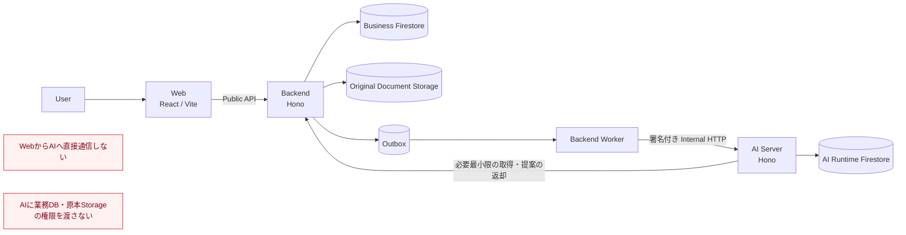

# after-flow

死亡後・相続手続きを、タスク管理とAI支援で前に進めるためのTypeScriptモノレポです。Frontend、Backend、AI Agentを独立したサービスとして分離し、業務状態の正本はBackendだけが管理します。

設計上の正本は [docs/architecture.md](docs/architecture.md) です。このREADMEは、リポジトリ全体の入口とローカル開発の案内を目的としています。

## システム構成



### 各ルートの責務

| ルート | 責務 | 詳細 |
| --- | --- | --- |
| `apps/web` | ユーザー向け画面、入力、API状態の表示 | [Frontend README](apps/web/README.md) |
| `apps/backend-server` | Public API、認証・認可、業務ルール、正式な業務状態、文書管理、AI実行制御 | [Backend README](apps/backend-server/README.md) |
| `apps/ai-server` | Backendから依頼されたAI処理、途中経過、根拠付き提案の生成 | [AI Agent README](apps/ai-server/README.md) |
| `packages/public-contracts` | FrontendとBackendが共有する公開API契約 | [Frontend/API対応表](docs/api/frontend-backend-mapping.md) |
| `packages/internal-contracts` | BackendとAI Serverが共有する内部実行契約 | [Backend内部実行API](docs/api/internal-execution.md) |
| `infra` | Emulator、ルール、同意文書、環境構築 | [インフラ構成](infra) |

Webは他ワークスペースから `public-contracts` だけを参照し、ブラウザ上の業務通信は必ずBackend Public APIを経由します。BackendとAI Serverは互いのソースコードやRepository実装をimportせず、内部HTTP契約だけで連携します。

## 主な処理フロー

### 通常の業務操作

1. WebがBackend Public APIへリクエストします。
2. Backendが認証・認可と業務ルールを検証します。
3. BackendがBusiness Firestoreへ正式な状態を保存します。
4. WebはBackendから返された状態を表示します。

### AIを使う非同期処理

1. Backendが `AgentRun` とOutboxイベントを同一の業務境界で作成します。
2. Backend WorkerがOutboxをleaseし、AI Serverへ署名付きの内部リクエストを送ります。
3. AI ServerはBackendのInternal APIから許可された情報だけを取得し、途中経過や提案を返します。
4. Backendが提案を検証し、正式な業務状態への反映可否を決定します。

AIは提案者であり、業務状態の書き込み主体ではありません。

### 書類の取り扱い

原本ファイルはBackend管理のStorageへ保存されます。書類検査の状態もBackendが管理し、検査に合格した書類だけをAI処理の対象にできます。AI Serverには原本Storageの認証情報を渡しません。

## 現在の実装状況

| 領域 | 現在の状態 |
| --- | --- |
| Frontend | 主要画面とMSWによるモック動作を実装済み。刷新済みUIを実Public APIへ接続する作業が今後の中心です。 |
| Backend | Public/Internal API、業務ドメイン、Firestore/Storage Adapter、認証・認可境界、AgentRun/Outboxの基盤を実装済みです。 |
| AI Agent | 実行Runtime、Workflow、Backend Client、評価などの基盤モジュールとテストがあります。ただし、標準起動時の本番向けProvider・Orchestrator・Runtime構成は未接続です。 |
| Authentication | Firebase Authenticationを採用済みです。Frontend/Backendの実接続、失効確認、招待などは未完了です。 |
| 非同期Worker | Worker実装はありますが、通常の `make up` や本番デプロイではまだ常駐起動されません。 |
| 書類検査 | 検査状態とAI投入制御はありますが、マイナンバー等を実際に検出・マスキングする検査Adapterは未選定・未実装です。 |

`/health` や `/internal/v1/health` の成功は、外部AI ProviderやOrchestratorまで準備できていることを意味しません。

## Dockerでまとめて起動する

必要なものはDocker、Docker Compose、GNU Makeです。ホスト側のNode.jsやpnpmは不要です。

```bash
make up
```

次の5サービスが起動します。

| サービス | URL / 接続先 |
| --- | --- |
| Web | http://127.0.0.1:5173 |
| Backend API | http://127.0.0.1:8080 |
| Swagger UI | http://127.0.0.1:8080/api-docs |
| Firestore Emulator | `127.0.0.1:8085` |
| Storage Emulator | http://127.0.0.1:4443 |
| AI Server | Docker内部ネットワークのみ。ホストには公開しません。 |

起動後の確認:

```bash
make ps
make data-check
node scripts/smoke-compose.mjs
```

停止:

```bash
make down
```

`make data-check` は、Emulatorの読み書きに加えて、AI ServerからBusiness Firestoreと原本文書Storageへ直接アクセスできない構成を確認します。

## Node.jsで開発する

使用するNode.jsとpnpmのversionは `.node-version` と `package.json` を参照してください。

```bash
pnpm install --frozen-lockfile
pnpm dev
```

個別サービスの起動方法や環境変数は、それぞれのREADMEを参照してください。

## API契約

Public APIのルート定義が、実行時バリデーションとOpenAPIの単一の情報源です。APIを変更した場合は仕様を再生成し、差分をコミットします。

```bash
pnpm openapi:generate
pnpm openapi:check
```

- OpenAPI: [docs/api/public-openapi.yaml](docs/api/public-openapi.yaml)
- Frontend/API対応表: [docs/api/frontend-backend-mapping.md](docs/api/frontend-backend-mapping.md)
- AI内部API: [docs/api/internal-execution.md](docs/api/internal-execution.md)
- 提案payload: [docs/api/proposal-payloads.md](docs/api/proposal-payloads.md)

## リポジトリ構成

```text
after-flow/
├── apps/
│   ├── web/                 # Frontend
│   ├── backend-server/      # 業務APIと正式状態の管理
│   └── ai-server/           # AI実行サービス
├── packages/
│   ├── public-contracts/    # 公開API契約
│   └── internal-contracts/  # Backend・AI間の内部契約
├── docs/                    # アーキテクチャ、API、ADR、Runbook
├── infra/                   # Emulator、デプロイ、環境定義
├── skills/                  # 開発参加者向けCodex Skill
├── compose.yaml
├── Makefile
└── pnpm-workspace.yaml
```

## 検証コマンド

変更内容に応じて、以下を実行します。

```bash
pnpm typecheck
pnpm lint
pnpm test
pnpm test:firestore
pnpm openapi:check
pnpm build
```

Dockerだけで検証する場合:

```bash
make check
```

Firestoreの永続化処理を変更した場合は、`pnpm test:firestore` によるEmulator検証が必須です。

## ドキュメント

- [アーキテクチャ](docs/architecture.md)
- [AIエージェント構成](docs/agent-architecture.md)
- [FrontendからBackendへの引き継ぎ](docs/backend-handoff-2026-09-21.md)
- [CI/CD運用](docs/ci-cd.md)
- [APIドキュメント](docs/api)
- [ADR](docs/adr)
- [Runbook](docs/runbooks)

## Backend開発用Skill

新しくBackend開発へ参加する人向けに、設計境界、実装手順、検証方法をまとめたCodex Skillを同梱しています。

```bash
mkdir -p "${CODEX_HOME:-$HOME/.codex}/skills"
ln -s "$PWD/skills/after-flow-backend-development" \
  "${CODEX_HOME:-$HOME/.codex}/skills/after-flow-backend-development"
```

詳細は [Skill本体](skills/after-flow-backend-development/SKILL.md) を参照してください。
