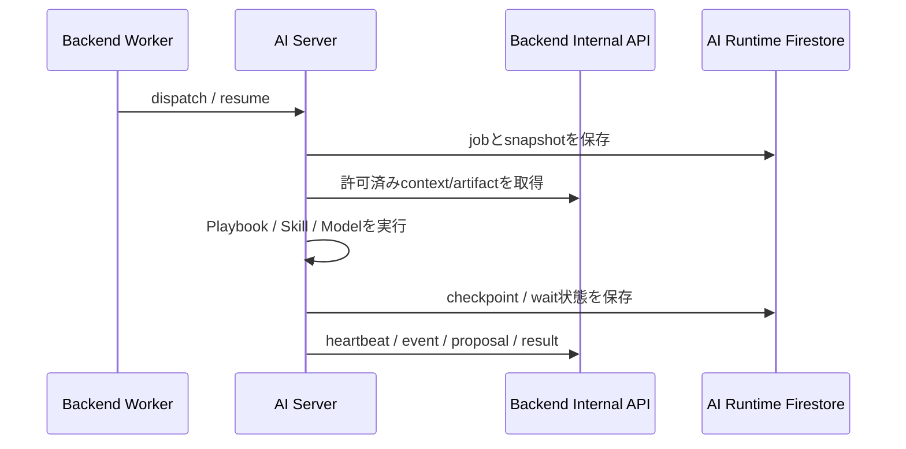

# AI Agent (`apps/ai-server`)

after-flowの内部AI実行サービスです。Backendから認証済みの実行依頼を受け、許可されたcontextだけを使って処理し、途中経過・根拠・提案・結果をBackendへ返します。

[ルートREADME](../../README.md) / [全体アーキテクチャ](../../docs/architecture.md) / [AIエージェント構成](../../docs/agent-architecture.md)

## 責務

- Backendが発行した `dispatch` / `resume` の受付と重複排除
- 実行snapshot、待機、再開、lease、heartbeatの管理
- Playbook、Skill、Research、Model policyを組み合わせたAI処理
- Backend Internal APIからの最小限のcontext・artifact取得
- 根拠、信頼度、未確認事項を含む提案・結果の返却
- fixture評価と、変更前後の品質比較

AI Serverは業務状態の書き込み主体ではありません。提案を正式状態へ反映する判断と処理はBackendが担当します。

## 絶対に越えない境界

- BrowserやFrontendから直接呼び出さない
- Business Firestoreの設定・資格情報を渡さない
- 原本文書Storageの設定・資格情報を渡さない
- Backendのソースコード、Repository実装、Domain Entityをimportしない
- Backendが発行したrun scopeの外にあるケース情報を取得しない
- AIの生成結果だけで、提出・解約・申請などの外部行為を実行しない
- 不確実な情報を確定事項として返さない

サービス間は `@aftercare/internal-contracts` と認証済みHTTP APIで連携します。

## 実行フロー



AI専用のRuntime Firestoreを使用する場合も、Business Firestoreとはprojectまたはdatabase、資格情報、networkを分離します。

## 現在の実装状況

次の基盤moduleとtestがあります。

- Durable execution runtimeとHTTP host lifecycle
- Backend Internal API client
- AI Runtime Firestore、snapshot codec、credential vault
- planning、guidance、chat、insight、insurance preparation等のPlaybook
- document reviewの境界と検査結果の取り扱い
- 公式情報源catalogと安全なHTTPS取得
- model allowlist、budget processor、fallback policy
- fixture評価、予算上限付きOrcaRouter実モデル評価、費用照合command

標準の `src/main.ts` は、開発環境で `ORCAROUTER_API_KEY` とAI専用Runtime設定がある場合、ハッカソン用のOrcaRouterモデル、公式資料Catalog、予算、永続Runtime、Workerを組み立てます。設定が無い場合はlivenessだけで起動し、実行endpointとreadinessは `AI_EXECUTION_NOT_CONNECTED` を返します。ハッカソン構成は `NODE_ENV=production` では起動できません。

## Internal API

Base pathは `/internal/v1` です。AI ServerのportはDocker hostへ公開しません。

| Method / Path | 用途 |
| --- | --- |
| `GET /health` | processのliveness確認。AI機能のreadinessではありません。 |
| `GET /ready` | Runtime/Workerが接続された場合だけ200を返すreadiness。モデル品質の保証ではありません。 |
| `POST /runs/:runId/dispatch` | 新しい実行依頼の受付 |
| `POST /runs/:runId/resume` | 待機中実行の再開 |
| `GET /runs/:runId/snapshot-status` | Backend reconciler向けsnapshot状態確認 |

実行endpointはBearer service token、audience、request ID、idempotency key、run/job ID、発行・失効時刻を検証します。Runtimeが接続されていない場合はfail closedします。

Backend側の契約は [Backend内部実行API](../../docs/api/internal-execution.md) を参照してください。

## ディレクトリ構成

```text
src/
├── application/
│   ├── execution/       # 実行契約
│   └── ports/           # Runtime等の抽象
├── orchestration/
│   ├── actions/         # 実行可能Actionの契約
│   ├── context/         # Run scopeに基づくContext構築
│   ├── documents/       # 書類review境界
│   ├── models/          # Model policy
│   ├── playbooks/       # 業務別の処理手順
│   ├── research/        # 調査結果・出典の契約
│   └── skills/          # Agent Skill catalog
├── infrastructure/
│   ├── backend-client/  # Backend Internal API client
│   ├── execution/       # RuntimeとHTTP host
│   ├── mastra/          # Mastra adapter
│   ├── research/        # 公式情報源と安全なHTTP取得
│   └── runtime-storage/ # AI専用Firestoreとsnapshot
├── presentation/        # Internal HTTP routes
└── main.ts              # 起動時composition
```

`orchestration` は特定ProviderのSDKへ依存させず、Provider固有処理は `infrastructure` に閉じ込めます。

## 起動

通常はルートからDockerで起動します。

```bash
make up
```

AI ServerだけをNode.jsで起動する場合:

```bash
pnpm install --frozen-lockfile
pnpm --filter @aftercare/ai-server dev
```

標準portは `8081` です。Dockerでは内部の `services` networkだけに接続し、hostへpublishしません。

## 設定

標準entrypointで使用する主な設定:

| 環境変数 | 用途 |
| --- | --- |
| `HOST` | bindするhost |
| `PORT` | listen port。既定は `8081` |
| `AI_SERVICE_TOKEN` | Backend WorkerからのBearer service token |
| `AI_SERVICE_AUDIENCE` | 想定audience。既定は `ai-server` |
| `AI_RUNTIME_MODE` | `auto` / `disabled` / `hackathon`。Docker開発環境の既定は `auto` |
| `ORCAROUTER_API_KEY` | OrcaRouterのAPIキー。AIコンテナだけへ渡す |
| `AI_ORCA_CORE_MODEL` | 第1モデル。開発既定は `openai/gpt-4o-mini` |
| `AI_ORCA_FALLBACK_MODEL` | 第2モデル。開発既定は `google/gemini-2.5-flash` |
| `BACKEND_INTERNAL_URL` | AIからBackend内部APIを呼ぶorigin |
| `BACKEND_INTERNAL_SERVICE_TOKEN` | AIからBackendへ送る専用サービス資格情報 |
| `AI_RUNTIME_ENCRYPTION_KEY` | receipt内の一時資格情報を暗号化するAI専用256-bit鍵 |

Runtimeには `AI_RUNTIME_PROJECT_ID`、`AI_RUNTIME_DATABASE_ID`、必要に応じて `AI_RUNTIME_EMULATOR_HOST` を設定します。`make up` はホスト非公開のAI専用Emulatorを起動し、AIコンテナを `restart: unless-stopped` で維持します。AIはBackend通信用、Runtime専用、OrcaRouter/許可済み公式HTTPS資料へのegress専用networkだけに参加します。`FIRESTORE_*`、`DOCUMENT_STORAGE_*`、`STORAGE_*`、`GOOGLE_APPLICATION_CREDENTIALS` など、Backendの業務データ用設定を流用してはいけません。

ルート `.env` に `ORCAROUTER_API_KEY` を設定して `make up` を実行すると、`GET /internal/v1/ready` が200になります。キーが無いCIや `AI_RUNTIME_MODE=disabled` では503です。BackendのOutbox workerと公開画面からの操作は次の接続段階であり、開発Composeは `AI_CONNECTED_OPERATIONS` を既定で空のままにします。

## テストと評価

```bash
pnpm --filter @aftercare/ai-server typecheck
pnpm --filter @aftercare/ai-server test
pnpm --filter @aftercare/ai-server build
```

AI Runtime Firestoreを変更した場合:

```bash
pnpm --filter @aftercare/ai-server test:firestore
```

fixture評価:

```bash
pnpm --filter @aftercare/ai-server eval:fixture
pnpm --filter @aftercare/ai-server eval:compare
```

OrcaRouter実モデル評価（APIキーと費用上限が必要）:

```bash
pnpm --filter @aftercare/ai-server eval:live-guidance --max-usd 5 --repetitions 2 --cases 8
```

評価範囲と直近の実測値は [AIの評価](EVALUATION.md)、Provider attemptと費用の扱いは [Provider Policy](PROVIDER_POLICY.md) を参照してください。

評価はcode testの代替ではありません。安全性、出典、専門家確認、未確認事項、token/cost budget、再現性を分けて確認します。

## 現在の未完了範囲

- 本番向けAI Provider、credential、model allowlistの確定
- production用のProvider Policy、同意grant、AI Runtime IAM/保持設定
- Backend Outbox workerと公開画面からの実行配送
- BackendとAI双方を含むdispatch、wait、resume、proposalのE2E検証
- AI専用Runtime Firestoreの本番project/database、IAM、index、保持期間の設定
- production向けtimeout、DLQ、snapshot不整合、Provider障害の監視とRunbook
- 品質・安全性・費用の継続評価と本番release基準の確定

health endpointが成功しているだけで、これらが完了したとは判断しないでください。
