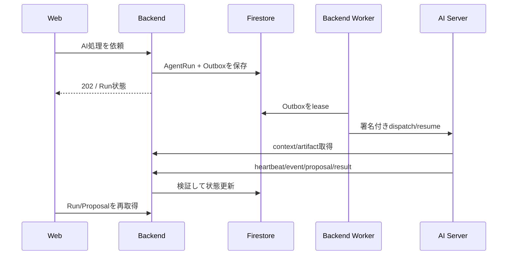

# Backend (`apps/backend-server`)

after-flowの業務APIです。HonoとTypeScriptで実装され、認証・認可、業務ルール、正式な業務状態、原本文書、AI実行制御を担当します。

[ルートREADME](../../README.md) / [全体アーキテクチャ](../../docs/architecture.md) / [OpenAPI](../../docs/api/public-openapi.yaml)

## 責務

- Web向けPublic APIの提供
- 認証済み利用者とケース単位の権限検証
- ケース、関係者、財産・債務、契約、給付、タスク、期限、同意の管理
- 書類メタデータと原本の保存、検査状態、AI投入可否の管理
- AI処理の `AgentRun`、Outbox、lease、再送、待機・再開の制御
- AIの提案を検証し、人の承認後に正式な業務状態へ反映
- AI Server向けに、実行単位で権限を絞ったInternal APIを提供

Backendは業務状態のSingle Writerです。FrontendやAI ServerがBusiness Firestoreを直接更新する構成にはしません。

## アーキテクチャ

```text
src/
├── domain/           # Entity、Value Object、業務上の不変条件
├── application/      # Use Case、Port、transaction境界
├── infrastructure/   # Firestore、Storage、認証、AI HTTP client、ルール設定
├── presentation/
│   ├── http/         # Middleware、共通response、error処理
│   ├── routes/       # Public/Internal API
│   ├── schemas/      # 実行時validation
│   └── openapi/      # OpenAPI生成
├── composition.ts    # 依存関係の組み立て
├── main.ts           # API process
└── worker-main.ts    # Outbox worker process
```

依存方向は `presentation → application → domain` です。InfrastructureはApplicationのPortを実装し、Domainから外部SDKへ依存させません。

## HTTP API

### Public API

- Base path: `/api/v1`
- Health: `GET /api/v1/health`
- Swagger UI: `/api-docs`（ローカル開発では既定で有効）
- OpenAPI: [docs/api/public-openapi.yaml](../../docs/api/public-openapi.yaml)

主なresourceはcases、persons、relationships、assets、liabilities、contracts、benefits、documents、tasks、deadlines、consents、agent-runs、proposals、approvals、inheritance-decisions、messages、insights、overviewです。

Public APIのroute定義が、実行時validationとOpenAPIの単一の情報源です。変更時は次を実行します。

```bash
pnpm openapi:generate
pnpm openapi:check
```

### AI向けInternal API

- Base path: `/internal/v1`
- 実行contextと許可済みartifactの取得
- heartbeat、event、result、proposal、wait requestの受付
- 実行のcontrol状態確認

Internal APIは必要な認証・署名設定がそろった場合だけmountされます。詳細は [Backend内部実行API](../../docs/api/internal-execution.md) を参照してください。

## AI実行フロー



Outbox workerの実装は `src/worker-main.ts` にあります。

```bash
pnpm --filter @aftercare/backend-server worker
pnpm --filter @aftercare/backend-server worker:once
```

対象tenantは `OUTBOX_TENANT_IDS` で明示します。暗黙の全tenant走査は行いません。`make up` は `backend-worker` container として常駐起動します（[Outbox Runbook](../../docs/runbooks/outbox-worker.md)）。本番デプロイへの組み込みはまだです。

## データとセキュリティの境界

- Business Firestoreと原本文書Storageの設定・資格情報はBackendにだけ渡す
- AI ServerはBackend Internal API経由で許可された情報だけを取得する
- tenant、case、run、operation、expiryを含む実行権限を検証する
- Backend→AIとAI→Backendのservice credentialを分ける
- 変更系APIではversion、idempotency、transactionを使い、競合や二重反映を防ぐ
- 認証設定がない場合、保護対象APIは `401` でfail closedする
- 機能の接続設定がない場合、空データを返して成功に見せず明示的に拒否する

## Authenticationと案件認可

Firebase Authenticationを採用し、Google loginとメールアドレス・passwordを初期対象とします。FrontendのFirebase Client SDK、BackendのJWT検証境界、ローカルAuth Emulator、`auth_time`による7日間のlogin上限は実装済みです。本番projectへの接続、token失効・停止確認、招待・共同利用は未完了です。

Firebaseはアカウントを認証し、Backendは保存済みmembershipを正本として案件ごとの権限を判定します。tenantやcase roleをtokenの自己申告だけで確定しません。詳細は [ADR 0001](../../docs/adr/0001-authentication-provider.md) を参照してください。

## 書類

Backendが書類のmetadataと原本を管理します。保存先は次のいずれか一方です。

- `DOCUMENT_STORAGE_ROOT`: 開発・CI向けlocal保存
- `DOCUMENT_STORAGE_BUCKET`: Cloud Storageまたはlocal Storage Emulator

両方を同時に指定した場合は設定errorにします。書類検査の状態とAI投入制御は実装されていますが、マイナンバー等を実際に検出・maskingする検査Adapterは未選定・未実装です。検査未接続時に合格扱いにはしません。

Storageの運用境界は [Document Storage Runbook](../../docs/runbooks/document-storage.md)、検査方式の未決事項は [ADR 0002](../../docs/adr/0002-document-inspection.md) を参照してください。

## 主な環境変数

完全な一覧と説明はリポジトリルートの [.env.example](../../.env.example) を参照してください。

| 分類 | 環境変数 |
| --- | --- |
| Server | `HOST`, `PORT`, `API_DOCS_ENABLED` |
| Firestore | `FIRESTORE_PROJECT_ID`, `FIRESTORE_EMULATOR_HOST` |
| Authentication | `AUTH_ISSUER`, `AUTH_AUDIENCE`, `AUTH_JWKS_URI`, `AUTH_ALGORITHMS` |
| Document Storage | `DOCUMENT_STORAGE_ROOT` または `DOCUMENT_STORAGE_BUCKET`, `DOCUMENT_STORAGE_EMULATOR_ENDPOINT`, `STORAGE_PROJECT_ID` |
| Business catalogs | `CONSENT_CATALOG_PATH`, `DEADLINE_RULES_PATH`（`NODE_ENV=production`では両方必須。未設定または`placeholder:true`のカタログではBackend/Workerが起動しない） |
| Backend → AI | `AI_SERVER_URL`, `AI_SERVICE_TOKEN`, `AI_SERVICE_AUDIENCE`, `AI_CONNECTED_OPERATIONS` |
| AI → Backend | `BACKEND_INTERNAL_SERVICE_TOKEN`, `BACKEND_SERVICE_AUDIENCE`, `BACKEND_EXECUTION_SIGNING_KEY` |
| Worker | `OUTBOX_TENANT_IDS`, `OUTBOX_INTERVAL_MS`, `OUTBOX_VISIBILITY_MS` |

server credentialを `VITE_*` として渡してはいけません。

## 起動

全サービスとEmulatorをDockerで起動する場合:

```bash
make up
```

BackendだけをNode.jsで起動する場合:

```bash
pnpm install --frozen-lockfile
pnpm --filter @aftercare/backend-server dev
```

Firestoreや認証を設定していない場合もhealth endpointは起動しますが、対応する業務APIはfail closedします。

ローカルでSwagger UIから業務APIを呼ぶ手順（Firebase Auth Emulatorのログインとseed）は [Local Swagger Runbook](../../docs/runbooks/local-swagger.md) を参照してください。

## テストと検証

```bash
pnpm --filter @aftercare/backend-server typecheck
pnpm --filter @aftercare/backend-server test
pnpm --filter @aftercare/backend-server openapi:check
pnpm --filter @aftercare/backend-server build
```

Firestoreの永続化、transaction、query、Outboxを変更した場合:

```bash
pnpm --filter @aftercare/backend-server test:firestore
```

Emulatorで未検証の永続化動作を「確認済み」と扱わないでください。

## 現在の未完了範囲

- Firebase Authenticationの本番project/JWKS、token失効・停止確認、staging接続検証
- 同意文書と期限ルールの業務レビュー、本番用catalogの確定
- 実書類検査Adapterの選定・実装
- Outbox workerの常駐deploy、監視、alert
- 本番向けAI Provider、Runtime、対応operationとのE2E接続。ローカルComposeでは設定したoperationをOutbox経由で配送可能
- 公開APIと画面の全シナリオを継続検証するブラウザーE2E

現在の契約は [Frontend / Backend対応表](../../docs/api/frontend-backend-mapping.md)、運用は [Outbox Runbook](../../docs/runbooks/outbox-worker.md) を参照してください。[Frontend刷新時の申し送り](../../docs/backend-handoff-2026-09-21.md) は2026-09-21時点の履歴資料です。
