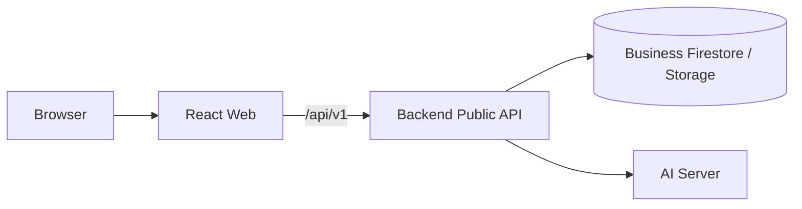

# Frontend (`apps/web`)

after-flowのユーザー向けWebアプリです。React、Vite、TypeScript、TanStack Query、React Routerで構成されています。

[ルートREADME](../../README.md) / [全体アーキテクチャ](../../docs/architecture.md) / [FrontendとAPIの対応表](../../docs/api/frontend-backend-mapping.md) / [Backendへの引き継ぎ](../../docs/backend-handoff-2026-09-21.md)

## 責務

* ケース、書類、タスク、財産・債務、家族、承認、チャットを画面に表示する
* 利用者の入力をBackend Public APIへ送る
* 読み込み中、AI処理中、失敗、未接続などの状態を正確に表示する
* Backendが算定した期限、状態、権限制御を再解釈せずに表示する
* MSWを使い、Backend未接続でも主要な利用フローを確認できるようにする

## サービス境界



FrontendからAI Server、Firestore、Storageへ直接接続してはいけません。他ワークスペースからimportできるのは `@aftercare/public-contracts` だけです。

## 起動

リポジトリルートで依存関係をインストールします。

```bash
pnpm install --frozen-lockfile
pnpm dev:web
```

http://127.0.0.1:5173 を開きます。開発時は既定でMSWが有効です。

Docker、Backend、Emulatorも含めて起動する場合:

```bash
make up
```

## API接続とMSW

| 環境変数                | 開発時の既定    | 本番ビルドの既定  | 用途                               |
| ------------------- | --------- | --------- | -------------------------------- |
| `VITE_USE_MOCK`     | `true`    | `false`   | MSWの有効化。デモ以外の本番で有効にしないでください。     |
| `VITE_API_BASE_URL` | `/api/v1` | `/api/v1` | Public APIのベースURL                |
| `VITE_API_PROXY`    | 未設定       | —         | ViteからBackendへ `/api` をプロキシする接続先 |

ローカルのBackendへ接続する例:

```bash
VITE_USE_MOCK=false \
VITE_API_PROXY=http://127.0.0.1:8080 \
pnpm dev:web
```

* API client: `src/lib/api/client.ts`
* TanStack Query hooks: `src/lib/api/queries.ts`
* MSW handlers: `src/mocks/handlers.ts`
* モックデータ: `src/mocks/db.ts`
* モックの期限・手続きルール: `src/mocks/rules.ts`
* モックの書類解析: `src/mocks/analysis.ts`

MSWのfixturesはUI仕様の一部です。構造変更時も既存の画面動作とfixturesを維持し、実APIとの意味のずれは[対応表](../../docs/api/frontend-backend-mapping.md)で確認します。

## 画面ルート

| ルート                                    | 画面                |
| -------------------------------------- | ----------------- |
| `/login`                               | ログイン              |
| `/consent`                             | 必須同意              |
| `/legal/:docId`                        | 同意文書              |
| `/cases`                               | ケース一覧             |
| `/cases/new`                           | ケース作成             |
| `/cases/:caseId/setup`                 | 故人の状況に基づく手続きの洗い出し |
| `/cases/:caseId`                       | ホーム               |
| `/cases/:caseId/tasks`                 | タスク・期限一覧          |
| `/cases/:caseId/tasks/:taskId`         | タスク詳細             |
| `/cases/:caseId/approvals`             | AIからの確認・Insight   |
| `/cases/:caseId/approvals/:approvalId` | 確認内容の詳細           |
| `/cases/:caseId/documents`             | 書類一覧・アップロード       |
| `/cases/:caseId/documents/:documentId` | 書類詳細              |
| `/cases/:caseId/property`              | 財産・債務・契約・給付       |
| `/cases/:caseId/family`                | 家族・相続人、相続方法       |
| `/cases/:caseId/chat`                  | AI相談チャット          |

`/cases/:caseId/insights` は承認画面のInsight tabへredirectします。

## モックの書類フロー

MSWでは「書類を追加 → AIが読み取る → AIからの確認に届く → 登録する」までを試せます。

ファイル名に含まれる文字によってモックの結果が変わります。

| ファイル名                                           | モック上の扱い                                                  |
| ----------------------------------------------- | -------------------------------------------------------- |
| `死亡診断書`                                         | 死亡診断書として読み取り。死亡届の必要書類「死亡診断書」がそろった扱いになる。「コピーをとっておく」の提案が届く |
| `通帳` / `預金`                                     | 預金口座の登録（残高は「読み取りに自信なし」）と、解約の提案（財産の処分に関わる）が届く。AIの気づきも1件   |
| `保険`                                            | 保険契約の登録と、保険金の請求の提案が届く                                    |
| `戸籍`                                            | 戸籍として読み取り。「さらに前の戸籍」の書類のお願いが届く                            |
| `遺言`                                            | 専門家への相談の提案と、専門家の確認が必要な気づきが届く                             |
| `ローン` / `借入`                                    | 借金などの登録が届く                                               |
| `契約` / `請求書`                                    | 契約の登録が届く                                                 |
| 上のどれも含まない                                       | 読み取れなかった扱い（「内容の確認が必要」）。撮り直しの案内が出る                        |
| `マスク`                                           | マイナンバーらしき記載を隠して保存した扱い                                    |
| `マイナンバー` / `個人番号` / `住民票` / `源泉徴収`              | マイナンバー記載としてお断り（保存されない）                                   |
| 拡張子が `pdf` / `jpg` / `jpeg` / `png` / `heic` 以外 | 対応していない形式としてお断り                                          |

同じ種類の書類を2回追加すると、「よく似た書類がすでに追加されています」の注意が出ます。

モックのデータはブラウザのメモリにあるだけなので、ページを再読み込みすると初期状態に戻ります。

### 元の書類の表示

追加したファイルは、そのまま原本として返します。手元の画像・PDFで表示を試せます。

最初から入っている見本の書類は実物が無いため、読み取った内容を読み取った位置（`sourceBox`）に書き込んだ見本の紙面を返します。

確認画面の枠が合っているかを、目で確かめられます。

読み取りの結果はファイル名で決まるため、実際の画像の中身と枠の位置は一致しません。

### 前回からの続き

`src/mocks/watch.ts` では、気づきを取りに来たときに次の2つを調べて気づきを作ります。

* **止まっている手続き**：初期データの「死亡届を提出する」は、4日前から動きがない見本です。
* **前提の変化**：家族・相続人で相続人を増やす・減らす、または相続放棄を記録したときに作ります。

## 書類の読み取りについて、API側で守っていただきたいこと

フロントエンドは実物の書類で確かめられていないため、次の約束に頼って動いています。

1. **`analysisStatus` は `ANALYZING` から `ANALYZED` か `NEEDS_REVIEW` に必ず変わること。**

   フロントエンドは読み取り中の書類がある間だけ3秒ごとに書類一覧を取り直し、状態が変わった時点で「AIからの確認」などを取り直します。

   `ANALYZING` のまま止まると、利用者は「読み取っています」を見続けることになります。

   失敗した場合も `NEEDS_REVIEW` にしてください（撮り直しの案内が出ます）。

2. **確認（Approval）・気づき（Insight）・必要書類の更新を保存し終えてから、`analysisStatus` を変えること。**

   順番が逆だと、フロントエンドが取り直した時点ではまだ何も無く、次に取り直すまで件数が合いません。

3. **エラーは `code` で返すこと。**

   マイナンバー検知は `MY_NUMBER_DETECTED`、形式違いは `UNSUPPORTED_FILE_TYPE`、大きすぎるファイルは HTTP 413。

   これ以外は「うまく送れませんでした」と出ます。

4. **読み取った位置（`sourceBox`）は、原本の幅・高さに対する割合（0〜1）で返すこと。**

   自信の無い値には `confidence: 'LOW'` を付けてください。

5. **同じ書類の二重取り込みを検知したら `possibleDuplicate` を付けること。**

6. **スマホの写真（HEIC）を受け付けるかどうかを決めてください。**

   受け付けない場合は `UNSUPPORTED_FILE_TYPE` を返せば、利用者に案内が出ます。

## UIで守る業務上の境界

* 期限はFrontendで算定せず、Backendが返した期限日、根拠、残日数、重要度を表示する
* 「承認」は提案を正式状態へ反映してよいかの確認であり、役所への提出や解約などの外部行為が完了したとは表示しない
* ログイン中の本人が単純承認を選んだと記録されるまで、財産処分につながる操作を安全側でlockする
* AI Insightは根拠が確認できる場合だけ表示し、`requiresProfessional` がある場合は専門家への確認を促す
* 調査結果は出典、確認日時、信頼度、未確認項目を隠さず表示する
* 書類は検査・解析状態を表示し、完了前に読み取り済みであるような表現をしない
* 401を受けた場合は保持tokenと利用者データのcacheを破棄する

## 実装時の確認事項

Public APIへの移行では、画面ごとに次を確認します。

1. `@aftercare/public-contracts` のDTOと実際のresponseが一致している
2. `202 Accepted` などの非同期responseを即時完了として扱っていない
3. `401`、`403`、`404`、`409`、`422`、`503` を利用者が次の行動を選べる状態で表示する
4. 空配列や仮データで未接続を成功に見せていない
5. MSWと実APIで同じ業務上の意味を保っている

## ディレクトリ構成

```text
src/
├── app/          # Router、QueryClient、認証・同意guard
├── kit/          # UI primitives、domain表示、toast、画面用語
├── shell/        # Sidebar、画面枠、AI解析状態の監視
├── screens/      # 画面単位の機能
├── lib/
│   └── api/      # Public API clientとQuery hooks
└── mocks/        # 開発用MSW、書類解析、期限・手続きルール
```

## 検証

```bash
pnpm --filter @aftercare/web typecheck
pnpm --filter @aftercare/web lint
pnpm --filter @aftercare/web test
pnpm --filter @aftercare/web build
```

リポジトリ全体を確認する場合:

```bash
pnpm typecheck
pnpm lint
pnpm test
pnpm build
```

## 現在の未完了範囲

* 複数相続人が同一ケースへアクセスする場合の権限設計は未反映。
* 専門家紹介の対価開示（「紹介料が発生する場合があります」等）は方針確定後に文言を追加する必要があります。
* 主要画面はMSWで動作しますが、刷新後の画面をPublic APIへ接続する作業が残っています。
* Firebase Authenticationの方針は決定済みですが、Client SDKとBackendの実接続は未完了です。
* 通知方式、複数相続人の共同利用、専門家紹介の表示方針には未実装・未確定の範囲があります。
* 文言は法務確認後に最終化する前提です。
* 文言とアクセシビリティは本番公開前に、法務・業務・ユーザビリティのレビューが必要です。

## 決まっていること

* 期限のお知らせは画面の中だけで行います。メール・プッシュ・SMSでの通知は提供しません。
