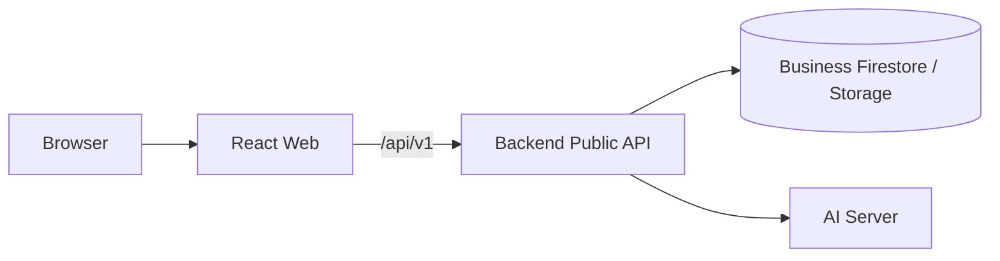

# Frontend (`apps/web`)

after-flowのユーザー向けWebアプリです。React、Vite、TypeScript、TanStack Query、React Routerで構成されています。

[ルートREADME](../../README.md) / [全体アーキテクチャ](../../docs/architecture.md) / [FrontendとAPIの対応表](../../docs/api/frontend-backend-mapping.md) / [Backendへの引き継ぎ](../../docs/backend-handoff-2026-09-21.md)

## 責務

- ケース、書類、タスク、財産・債務、家族、承認、チャットを画面に表示する
- 利用者の入力をBackend Public APIへ送る
- 読み込み中、AI処理中、失敗、未接続などの状態を正確に表示する
- Backendが算定した期限、状態、権限制御を再解釈せずに表示する
- MSWを使い、Backend未接続でも主要な利用フローを確認できるようにする

## サービス境界



FrontendからAI Server、Firestore、Storageへ直接接続してはいけません。他ワークスペースからimportできるのは `@aftercare/public-contracts` だけです。

## 起動

リポジトリルートで依存関係をインストールします。

```bash
pnpm install --frozen-lockfile
pnpm dev:web
```

http://127.0.0.1:5173 を開きます。開発時は既定でMSWが有効です。

Docker、Backend、Emulatorも含めて起動する場合:

```bash
make up
```

## API接続とMSW

| 環境変数 | 開発時の既定 | 本番ビルドの既定 | 用途 |
| --- | --- | --- | --- |
| `VITE_USE_MOCK` | `true` | `false` | MSWの有効化。デモ以外の本番で有効にしないでください。 |
| `VITE_API_BASE_URL` | `/api/v1` | `/api/v1` | Public APIのベースURL |
| `VITE_API_PROXY` | 未設定 | — | ViteからBackendへ `/api` をプロキシする接続先 |

ローカルのBackendへ接続する例:

```bash
VITE_USE_MOCK=false \
VITE_API_PROXY=http://127.0.0.1:8080 \
pnpm dev:web
```

- API client: `src/lib/api/client.ts`
- TanStack Query hooks: `src/lib/api/queries.ts`
- MSW handlers: `src/mocks/handlers.ts`
- モックデータ: `src/mocks/db.ts`
- モックの期限・手続きルール: `src/mocks/rules.ts`
- モックの書類解析: `src/mocks/analysis.ts`

MSWのfixturesはUI仕様の一部です。構造変更時も既存の画面動作とfixturesを維持し、実APIとの意味のずれは [対応表](../../docs/api/frontend-backend-mapping.md) で確認します。

## 画面ルート

| ルート | 画面 |
| --- | --- |
| `/login` | ログイン |
| `/consent` | 必須同意 |
| `/legal/:docId` | 同意文書 |
| `/cases` | ケース一覧 |
| `/cases/new` | ケース作成 |
| `/cases/:caseId/setup` | 故人の状況に基づく手続きの洗い出し |
| `/cases/:caseId` | ホーム |
| `/cases/:caseId/tasks` | タスク・期限一覧 |
| `/cases/:caseId/tasks/:taskId` | タスク詳細 |
| `/cases/:caseId/approvals` | AIからの確認・Insight |
| `/cases/:caseId/approvals/:approvalId` | 確認内容の詳細 |
| `/cases/:caseId/documents` | 書類一覧・アップロード |
| `/cases/:caseId/documents/:documentId` | 書類詳細 |
| `/cases/:caseId/property` | 財産・債務・契約・給付 |
| `/cases/:caseId/family` | 家族・相続人、相続方法 |
| `/cases/:caseId/chat` | AI相談チャット |

`/cases/:caseId/insights` は承認画面のInsight tabへredirectします。

## ディレクトリ構成

```text
src/
├── app/          # Router、QueryClient、認証・同意guard
├── kit/          # UI primitives、domain表示、toast、画面用語
├── shell/        # Sidebar、画面枠、AI解析状態の監視
├── screens/      # 画面単位の機能
├── lib/
│   └── api/      # Public API clientとQuery hooks
└── mocks/        # 開発用MSW、書類解析、期限・手続きルール
```

## UIで守る業務上の境界

- 期限はFrontendで算定せず、Backendが返した期限日、根拠、残日数、重要度を表示する
- 「承認」は提案を正式状態へ反映してよいかの確認であり、役所への提出や解約などの外部行為が完了したとは表示しない
- ログイン中の本人が単純承認を選んだと記録されるまで、財産処分につながる操作を安全側でlockする
- AI Insightは根拠が確認できる場合だけ表示し、`requiresProfessional` がある場合は専門家への確認を促す
- 調査結果は出典、確認日時、信頼度、未確認項目を隠さず表示する
- 書類は検査・解析状態を表示し、完了前に読み取り済みであるような表現をしない
- 401を受けた場合は保持tokenと利用者データのcacheを破棄する

## モックの書類フロー

MSWでは「書類を追加 → AIが読み取る → AIからの確認に届く → 登録する」までを試せます。ファイル名に `死亡診断書`、`通帳`、`保険`、`戸籍`、`遺言` などを含めると結果が変わります。`マイナンバー`、`個人番号`、`住民票`、`源泉徴収` を含む場合は保存を拒否します。

これはUI確認用のfixtureであり、実際の文書検査・OCR・マスキングが実装済みであることを意味しません。実API接続後はBackendの検査状態とerror codeを正本にします。

## 実装時の確認事項

Public APIへの移行では、画面ごとに次を確認します。

1. `@aftercare/public-contracts` のDTOと実際のresponseが一致している
2. `202 Accepted` などの非同期responseを即時完了として扱っていない
3. `401`、`403`、`404`、`409`、`422`、`503` を利用者が次の行動を選べる状態で表示する
4. 空配列や仮データで未接続を成功に見せていない
5. MSWと実APIで同じ業務上の意味を保っている

## 検証

```bash
pnpm --filter @aftercare/web typecheck
pnpm --filter @aftercare/web lint
pnpm --filter @aftercare/web test
pnpm --filter @aftercare/web build
```

リポジトリ全体を確認する場合:

```bash
pnpm typecheck
pnpm lint
pnpm test
pnpm build
```

## 現在の未完了範囲

- 主要画面はMSWで動作しますが、刷新後の画面をPublic APIへ接続する作業が残っています。
- Firebase Authenticationの方針は決定済みですが、Client SDKとBackendの実接続は未完了です。
- 通知方式、複数相続人の共同利用、専門家紹介の表示方針には未実装・未確定の範囲があります。
- 文言とアクセシビリティは本番公開前に、法務・業務・ユーザビリティのレビューが必要です。
