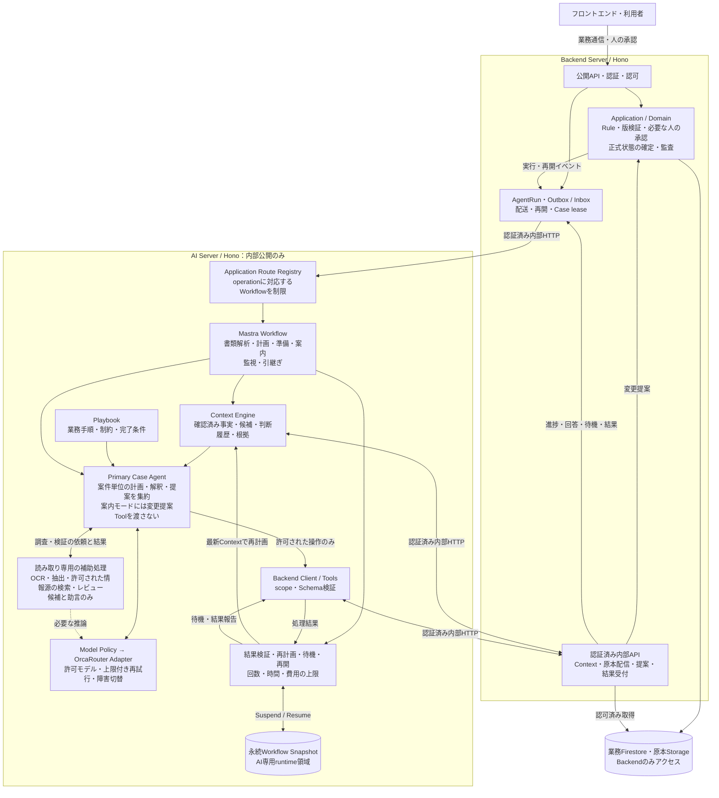

# AIエージェント構成

[設計仕様](architecture.md)に基づく現在の責務図。Primary Case Agentと読み取り専用の調査処理を分け、Backendだけが正式な業務状態を確定する。開発環境ではMastra、AI Runtime、OrcaRouter経由の推論を接続できるが、本番準備は別途必要である。

同じCaseのAI変更提案は直列化し、正式な書き込みはBackendに集約する。補助処理は業務状態を変更しない。
